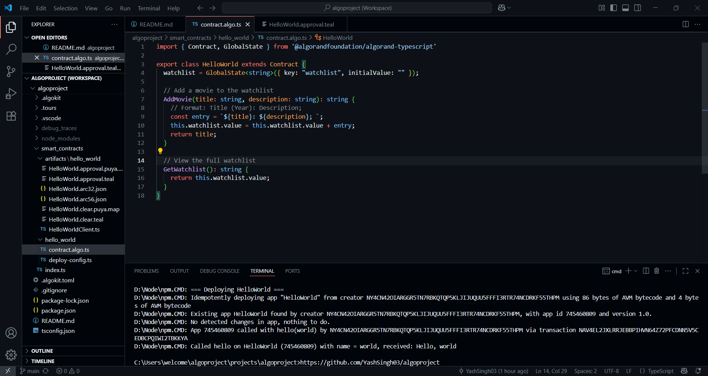
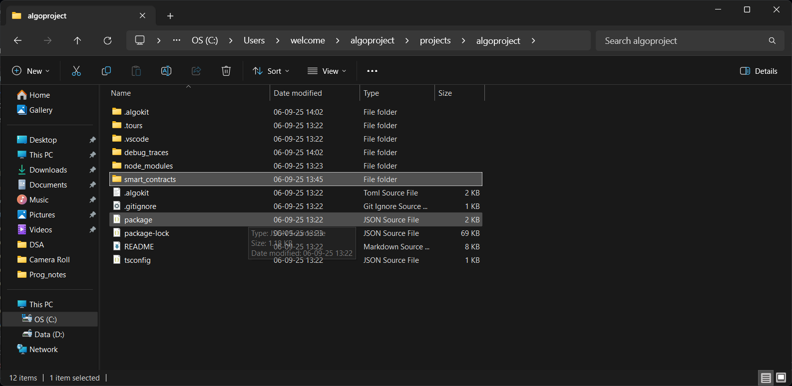

# 🎬 Movie Watchlist dApp on Algorand

Welcome to the **Movie Watchlist dApp** — a simple decentralized application built on the **Algorand blockchain** that lets you keep track of movies you want to watch. This project is beginner-friendly and built using TypeScript smart contracts for Algorand.

---

## 📖 Project Description

This dApp allows users to add movies to a shared watchlist on-chain. Whether you're tracking new releases or classic favorites, this decentralized watchlist ensures that your movie interests are stored securely and immutably on the Algorand blockchain.

Built using:

- 🧠 **Algorand Smart Contracts (ASC1)**
- 💻 **TypeScript SDK**
- ⚙️ **Global State Management**

---

## ✅ What It Does

- Adds a movie title and description to the global watchlist.
- Stores the full watchlist on-chain (as a single string).
- Lets users view the complete watchlist anytime.

This is perfect for learning how to interact with global state on Algorand using TypeScript.

---

## ✨ Features

- 📌 **Add Movies** – Input a title and description to grow the shared watchlist.
- 📃 **View Watchlist** – Instantly retrieve all movies in the list.
- 🛠️ **Simple Contract Logic** – Beginner-friendly smart contract design.
- 🛡️ **Immutable Storage** – Watchlist entries are stored securely on-chain.

---

## 🔗 Deployed Smart Contract

> 🛰️ **Deployed App ID**: `XXX`  
> 🔗 **Deployed Contract Link**: [View on AlgoExplorer](https://testnet.algoexplorer.io/application/XXX)

---

## 🧠 Smart Contract Code: NY4CN42OIARGGR5TN7RBKQTQP5KLJIJUQUU5FFFI3RTR74NCDRKF55THPM

```ts
// paste your code
import { Contract, GlobalState } from '@algorandfoundation/algorand-typescript'

export class HelloWorld extends Contract {
  watchlist = GlobalState<string>({ key: "watchlist", initialValue: "" });

  // Add a movie to the watchlist
  AddMovie(title: string, description: string): string {
    // Format: Title (Year): Description;
    const entry = `${title}: ${description}; `;
    this.watchlist.value = this.watchlist.value + entry;
    return title;
  }

  // View the full watchlist
  GetWatchlist(): string {
    return this.watchlist.value;
  }
}




